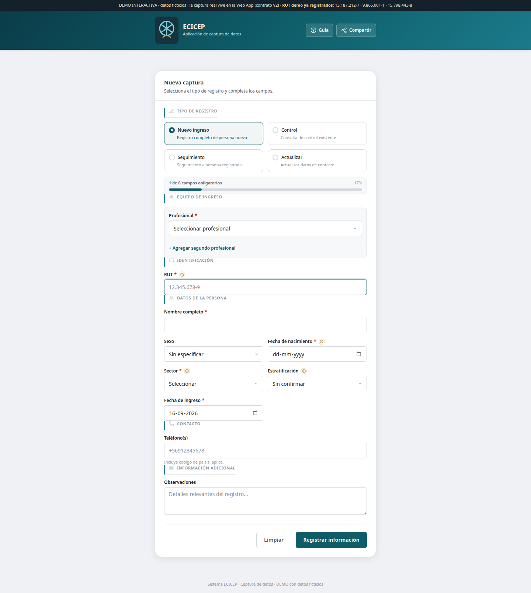

# ECICEP — Sistema de Gestión Sanitaria por Sectores

> Plataforma de captura, seguimiento clínico y reporte construida sobre
> **Google Apps Script + Google Sheets**, con una **Web App** como único canal
> operativo de captura y un backend de reglas de negocio testeable.
>
> **Naturaleza:** proyecto **particular**, desarrollado a medida para una
> profesional de enfermería como cliente. **No es un desarrollo institucional.**

[](https://github.com/2674321/Sistema-Gestion-Sectores-ECICEP/actions/workflows/ci.yml)
[](https://2674321.github.io/Sistema-Gestion-Sectores-ECICEP/)
[](https://github.com/2674321/Sistema-Gestion-Sectores-ECICEP/releases/tag/v0.9.3)
[](LICENSE)

## De un vistazo

| | |
|---|---|
| **Modelo de datos** | `PACIENTES` (estado vigente) + `EVENTOS` (historial inmutable) + vistas derivadas |
| **Canal de captura** | Web App (contrato de captura V4, compatible con V2/V3 e idempotente) |
| **Unidades territoriales** | Sectores (Amarillo · Verde · Naranjo) |
| **Reportes** | REM mensual en Excel y PDF, estadísticas con gráficos, dashboard de indicadores |
| **Calidad** | Normalización, deduplicación trazable, cola de revisión, auditoría |
| **IA asistente** | Gemini API: análisis de calidad, duplicados, integridad, corrección asistida (ver sección [Integración de IA](#integración-de-ia)) |
| **Entornos** | **Uno solo** — un Spreadsheet, un proyecto Apps Script, una fuente de verdad |
| **Estado** | Operativo · `v0.9.15` · verificación completa con `node tools/verificar.mjs` |

## Qué resuelve

Equipos de salud territorial suelen trabajar con **planillas Excel independientes
y estructuras distintas**, una por sector o programa. Las consecuencias son
conocidas:

- **Doble trabajo** al buscar a una persona que aparece en más de una planilla.
- **Imposible saber de un vistazo** quiénes existen, su estado, su próximo
  control o quién requiere seguimiento.
- **Formatos inconsistentes** (RUT, teléfonos, fechas, estados) incluso dentro
  de una misma hoja.

ECICEP integra esas fuentes en **una única base operativa**, normaliza y
consolida los datos y provee una interfaz simple para el uso cotidiano.

## Capacidades

**Base unificada y trazable**
- Personas (`PACIENTES`) con identidad canónica y **historial de eventos
  inmutable** (`EVENTOS`, append-only); origen, sector y fecha de cada registro.
- Deduplicación **explicable, reversible y trazable**; dudosos van a la cola de
  revisión, nunca se descartan a ciegas.

**Normalización automática**
- RUT con **módulo 11** (formato, dígito verificador y validación en vivo),
  teléfonos, fechas, nombres sin tildes y estados canónicos.

**Modelo clínico por persona**
- **Estratificación de riesgo** `G1/G2/G3` desde patologías.
- Agenda manual de próxima atención. **Estado** (VENCIDO / POR VENCER /
  VIGENTE / SIN FECHA) y **recordatorio** derivados de la fecha guardada.

**Edición desde la Web App**
- La acción Actualizar carga una ficha por RUT y permite corregir datos personales,
  contacto, sector, estado, ingreso, patologías y agenda manual. Permite registrar
  una nueva atención o corregir la fecha de la última con trazabilidad.

**Seguimiento y controles**
- Registro de controles y seguimientos, fecha de próximo control manual, editable desde Captura y ficha.
  Panel *Controles por persona* con búsqueda y paginación.

**Reportes**
- **REM mensual** derivado de EVENTOS: resumen por censo + detalle por atención,
  exportable a **Excel (.xlsx)** y **PDF profesional**.
- Estadísticas con 5 indicadores y gráficos, filtro cruzado por sector y fecha.

**Captura Web App (único canal operativo)**
- Formulario responsivo con 4 operaciones (`nuevoIngreso`, `registrarControl`,
  `registrarSeguimiento`, `actualizarDatos`), validación por capas, **idempotencia
  de reenvíos** y trazabilidad por envío — especificado en
  `docs/CONTRATO_CAPTURA_V2.md` (**NORMATIVO**).
- QR para compartir el acceso al canal de captura.
- El botón Captura del menú Sheets genera un enlace con clave compartida para
  abrir la Web App desde cualquier dispositivo, sin cuenta Google. Conviene
  compartir ese enlace solo con operadores autorizados; la URL base no abre
  fichas para visitantes anónimos.
- La ficha y los paneles de registro, configuración y Backups reutilizan la
  misma clave para funcionar desde distintas cuentas con acceso a Sheets.
  Google Sheets requiere una cuenta Google para abrir la hoja; el acceso sin
  cuenta a Captura se realiza desde la Web App.

**Operación y confiabilidad**
- Instalador/reparador por **etapas** con diagnóstico de solo lectura,
  **versionado de esquema y motor de migraciones** (idempotente).
- Backups manuales y automáticos, cola de calidad, auditoría integral,
  protección por categoría de hojas, filtros y buscador por hoja.
- Diseño visual del libro normalizado por un **design system** único (tokens en
  `00_Tokens`), contrastes accesibles y una sola tinta.

## Integración de IA

ECICEP incorpora su **primera integración de IA generativa** como capacidad de
asistencia técnica para **análisis, automatización y calidad de datos**:
Google **Gemini API** desde `Google Apps Script` sobre la base de `Google Sheets`.

Qué hace hoy la capa de IA (detalle en `docs/INFORME_IA_GEMINI.md`):

- **Análisis de calidad de datos** — estructura y estadísticas de las hojas,
  detección de inconsistencias de formato y campos vacíos.
- **Detección de duplicados** — por RUT, ejecutada **100% en memoria** (no envía
  datos a la API).
- **Verificación de integridad** — eventos huérfanos (evento sin paciente),
  también local.
- **Corrección asistida** — RUT, fechas, nombres, teléfonos y sexo reutilizando
  los normalizadores deterministas del sistema, con registro en `LOG_IA`.
- **Asistencia por lenguaje natural** — traducción de instrucciones a acciones
  del sistema.
- **Auditoría y trazabilidad** — cada cambio queda registrado y revisable.

La IA **no realiza diagnóstico médico ni reemplaza el criterio profesional**:
es una herramienta de validación, detección de patrones, consistencia y
automatización de tareas de datos. Diseñada con un **enfoque de minimización de
datos** (estructura, estadísticas y patrones; duplicados e integridad locales) y
con la **API key fuera del código fuente** (Script Properties).

> El panel y el menú de IA fueron retirados. El módulo `src/28_IA.js` se conserva
> como soporte técnico interno; no hay una interfaz de IA operativa para la cliente.

## Demo interactiva

Puedes probar una **réplica estática exacta** del formulario de captura (misma
interfaz, mismas secciones y mismas validaciones, **datos ficticios**, sin
conexión a Apps Script) en línea:

- **🌐 En línea:** <https://2674321.github.io/Sistema-Gestion-Sectores-ECICEP/>
- **Local:** abre `examples/formulario_demo.html` en un navegador (doble clic).

Incluye RUT de ejemplo que ya existen en la base demo (13.187.212-7,
9.866.001-1, 15.798.443-8) para ver el comportamiento de personas registradas.

## Captura de la Web App



Captura ilustrativa anterior a v0.9.11, con datos ficticios. La Web App operativa
añade el campo manual Próximo control / seguimiento.

## Arquitectura

Un solo sistema operativo (una Web App, un backend, un pipeline, una fuente de
verdad). Google Sheets cumple la función administrativa interna; la captura
operativa vive **solo** en la Web App.

```text
                ECICEP
                   │
         ┌─────────┴─────────┐
         │                   │
      WEB APP            SHEETS / ADMIN
         │                   │
         └─────────┬─────────┘
                   │
                BACKEND
                   │
                PIPELINE
                   │
                  MODELO
        PACIENTES + EVENTOS + DERIVADOS
                  ─ SECTORES · DASHBOARD · REM · LOG ─
```

Contrato de captura vigente (operaciones, payload, estados, errores):
`docs/CONTRATO_CAPTURA_V2.md` (**NORMATIVO**, única fuente).

## Stack

`Google Apps Script · Google Sheets · HTML/CSS/JS (Web App) · Gemini API ·
Git · Clasp · SheetJS (Excel) · Chart.js (gráficos) · PDF local`

Sin dependencias externas salvo beneficio demostrable. Código en paquetes
planos numerados (`src/00_Config.js … src/28_IA.js`) sincronizados con `clasp`.

## Estado del proyecto

| Componente | Estado |
|---|---|
| Núcleo (normalización, modelo, pipeline) | ✅ Implementado |
| Web App de captura (contrato V2) | ✅ Operativo |
| Instalador + motor de migraciones | ✅ Operativo (fase INST-1 cerrada) |
| REM Excel / PDF · Estadísticas · Dashboard | ✅ Implementados |
| Calidad, auditoría, backups | ✅ Implementados |
| IA asistente (Gemini API) | ✅ Implementada (asistencia, no núcleo) |
| E2E real | ✅ Verificado en libro operativo |

**Verificación vigente:** `node tools/verificar.mjs` comprueba sintaxis JS/GS y
las 11 suites disponibles: **941 pruebas** y **17 scripts HTML**. Incluye 19 casos
nuevos de regresión y publicación. Detalle y límites de verificación real en
[`docs/INFORME_REVISION_2026_09_16.md`](docs/INFORME_REVISION_2026_09_16.md).

**Regla vigente:** el procesamiento masivo de datos reales requiere instrucción
explícita (migración controlada: análisis → validación → simulación → reporte →
migración). Los datos personales y sanitarios nunca salen del entorno de la
cliente hacia repositorios públicos.

## Autoría

Desarrollado por [Patricio Varela C.](https://github.com/2674321) ·
[ORCID](https://orcid.org/0009-0002-1087-9445).

## Documentación

| Documento | Propósito |
|---|---|
| `AGENTS.md` | Contrato permanente de trabajo para agentes |
| `ARQUITECTURA.md` | Arquitectura técnica y funcional vigente |
| `MODELO-DATOS.md` · `MODELO-EVENTOS.md` | Modelo PACIENTES y EVENTOS |
| `docs/CONTRATO_CAPTURA_V2.md` | Contrato de captura V2 — **NORMATIVO** |
| `docs/INFORME_IA_GEMINI.md` | Integración de IA generativa (Gemini) — vigente |
| `docs/INFORME_V097.md` | Fase v0.97: auditoría rendimiento/IA/frontend y cierres |
| `DECISIONES.md` | Registro de decisiones (DEC-XXX) |
| `docs/MIGRACIONES.md` | Motor de migraciones de esquema |
| `docs/VERSIONADO.md` | Versionado del esquema |
| `docs/HISTORIAL.md` | Evolución completa por versión (historial) |
| `CONTEXTO.md` | Cliente, naturaleza y reglas generales |
| `PENDIENTES.md` | Trabajo pendiente real |

## Estructura

```text
Sistema-Gestion-Sectores-ECICEP/
├── src/                   # Código Apps Script (sincronizado con clasp)
│   ├── 00_Config.js …     # Config, tokens, núcleo, modelo, hojas, UI
│   ├── 10_Pruebas.js      # Suites deterministas (651)
│   ├── 24_Formulario.js   # Backend de captura Web App
│   ├── 26_Captura.js      # Backend contrato de captura V2
│   ├── 28_IA.js           # Módulo IA (Gemini API): análisis, calidad, corrección asistida
│   └── CapturaWeb.html    # Formulario Web App (canal de captura)
├── tests/                 # Baterías ejecutables: node tests/*.mjs
│   ├── ejecutar_local.mjs # Núcleo (597 deterministas)
│   ├── formulario_web.mjs # Lógica real de CapturaWeb.html (27)
│   ├── captura_ui_payload_v2.mjs, captura_backend_v2.mjs, contrato_*.mjs…
│   └── validar_html.mjs   # Sintaxis de <script> embebidos en los HTML
├── examples/              # Réplicas/demos (ej. formulario_demo.html)
├── tools/                 # push_y_abrir.sh, sync_remoto.py…
└── docs/                  # Documentación vigente
```

## Reglas críticas

1. Nunca se versionan datos reales en Git (`.gitignore` ya configurado).
2. `clasp push` solo desde esta carpeta (proyecto Apps Script vinculado).
3. Deduplicación explicable, reversible y trazable; dudosos → revisión manual.
4. Lecturas/escrituras por bloques; nunca `getValue/setValue` en loops.
5. Toda decisión arquitectónica se registra en `DECISIONES.md`.

## Evolución

El sistema se construyó y estabilizó en fases incrementales (`v0.5.0` → `v0.9.3`,
más las fases S9/S10/INST-1 y MEJORA-INST1.1). El detalle completo por versión,
incluidos los desenlaces técnicos (rendimiento, auditorías, instalador
versionado, despliegues) está en **`docs/HISTORIAL.md`**.
