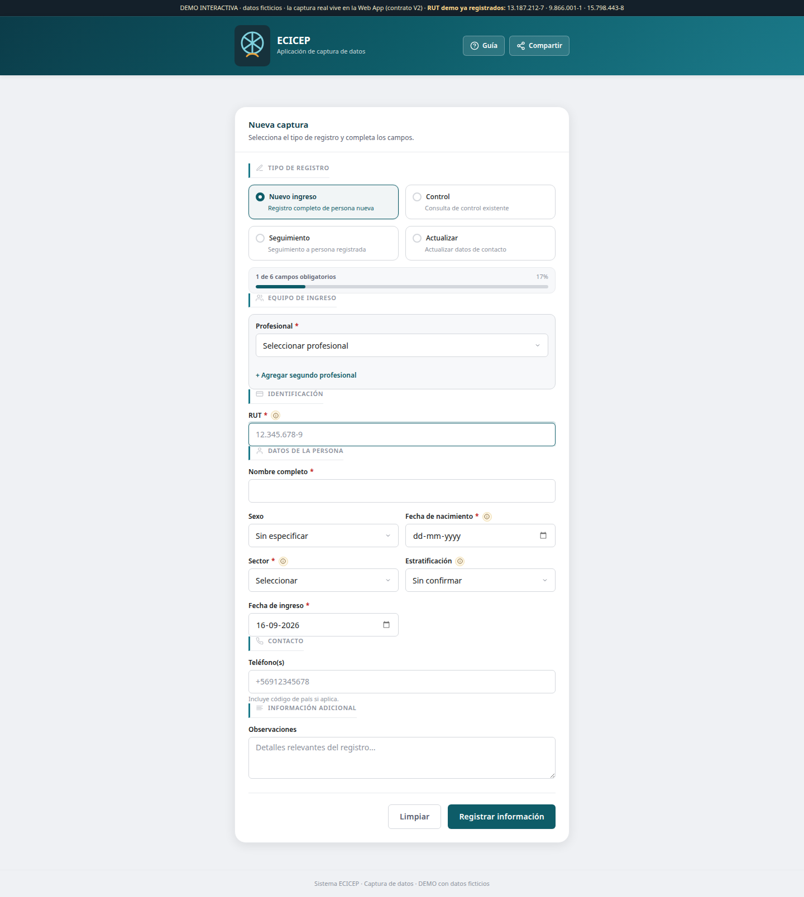

# ECICEP — Sistema de Gestión Sanitaria por Sectores

<p align="center"></p>


<p align="center"></p>

**Autor:** [Patricio Varela C.](https://github.com/2674321) · **ORCID:** [0009-0002-1087-9445](https://orcid.org/0009-0002-1087-9445) · **Licencia:** [MIT](LICENSE) · **Citación:** [CITATION.cff](CITATION.cff)

> Plataforma de captura, seguimiento clínico y reporte construida sobre
> **Google Apps Script + Google Sheets**, con una **Web App** como único canal
> operativo de captura y un backend de reglas de negocio testeable.
>
> **Naturaleza:** proyecto **particular**, desarrollado a medida para una
> profesional de enfermería como cliente. **No es un desarrollo institucional.**

[](https://github.com/2674321/Sistema-Gestion-Sectores-ECICEP/actions/workflows/ci.yml)
[](https://2674321.github.io/Sistema-Gestion-Sectores-ECICEP/)
[](https://github.com/2674321/Sistema-Gestion-Sectores-ECICEP)
[](LICENSE)

## De un vistazo

| | |
|---|---|
| **Modelo de datos** | `PACIENTES` (estado vigente) + `EVENTOS` (historial inmutable) + vistas derivadas · esquema 2 (MIG-002) |
| **Canal de captura** | Web App (pipeline V4 idempotente, compatible V2/V3; contrato de captura **V4** normativo en `docs/CONTRATO_CAPTURA_V2.md`) |
| **Unidades territoriales** | Sectores (Amarillo · Verde · Naranjo) |
| **Reportes** | REM mensual en Excel y PDF, estadísticas con gráficos, dashboard de indicadores |
| **Calidad** | Normalización, deduplicación trazable, cola de revisión, auditoría |
| **Entornos** | **Uno solo** — un Spreadsheet, un proyecto Apps Script, una fuente de verdad |
| **Estado** | `v0.16.4` — ningún campo aceptado se pierde (DEC-104: identificadores automáticos, `profesionalSecundario` persistido, teléfonos recuperables, índices de CONFLICTOS y fila de RUT correctos); nada se pierde en silencio (DEC-103); el acceso concede siempre (DEC-102); esquema clínico 2 y Captura V4 sin cambios |

## v0.16.4 — ningún campo aceptado se pierde (DEC-104)

La identidad de los registros era **posicional** y dos campos que el contrato de
captura declara opcionales se aceptaban y luego se perdían. Ambas cosas son la
misma clase de fallo: el sistema acepta el dato, informa éxito y la información
no queda en ninguna parte.

- **Identidad posicional.** `Ingresos_procesarFilas` generaba `EC-000001`,
  `EC-000002`… según el **orden del lote**: el mismo lote reordenado producía
  identidades distintas y un staging reprocesado podía reasignar la identidad de
  un paciente ya incorporado. Ahora `ID_INTERNO` es `EC-<base36 tiempo>-<rand4>`
  y `ID_EVENTO` es `EV-<base36 tiempo>-<rand4>`; la secuencia determinista existe
  solo por inyección explícita (`{secuenciaTest: n}`) y ningún camino productivo
  la usa. El resolver nunca devuelve un ID vacío o repetido, y las altas se
  niegan a escribir un `ID_INTERNO` duplicado. Los IDs históricos no canónicos se
  conservan: no se reescribe nada ya incorporado.
- **`profesionalSecundario` se aceptaba y se perdía.** El contrato lo declara
  `OPC` en las cuatro operaciones y la Web App lo enviaba, pero ninguna llamada
  a `Eventos_registrarPaciente_` lo transmitía y EVENTOS no tenía dónde
  guardarlo. Ahora se persiste en la columna nueva `PROFESIONAL2`, añadida **al
  final** del esquema (las columnas previas no se desplazan) y reconciliada de
  forma idempotente; los eventos históricos quedan vacíos.
- **Un teléfono escrito con espacios se perdía entero.**
  `Norm_normalizarTelefono` validaba cada fragmento por separado, así que
  `9 6060 0712`, `+56 9 9060 0712` o `(2) 2345 6789` —las formas más naturales
  de escribir un teléfono— producían `VACIO` con todos los fragmentos
  descartados. Ahora se interpreta primero la corrida completa de dígitos; los
  varios números en un mismo campo (`a / b`) siguen siendo varios. Además
  `TELEFONO_OBS` persiste las anotaciones de fuente y **todo** descarte.
- **La cola de calidad leía la columna equivocada.** `Calidad_sincronizarCola_`
  mezclaba base 0 con base 1 y leía `FUENTE_B` en vez de `FUENTE_A`:
  `filasCalidad` quedaba siempre vacío, cada sincronización **duplicaba** la
  cola y el auto-resolve era código muerto. Los índices se derivan ahora del
  encabezado real.
- **`Calidad_normalizarFormatoRuts_` escribía sobre el banner.** Usaba `2 + ix`
  como fila física en PACIENTES, que tiene layout visual (datos desde la fila 4):
  con `ix=0` escribía el RUT en el banner y con `ix=1` sobre los encabezados. La
  coordenada sale ahora de `Modelo_filaFisica`.
- **IDs de ejecución solo con el reloj.** `CARGA-`/`ACT-`/`EJ-` se componían
  únicamente de `Date.now()`, con lo que dos ejecuciones en el mismo milisegundo
  compartían identificador. Llevan sufijo aleatorio.

Guardas: `tests/ids_automaticos_vNEXT.mjs` (15 casos),
`tests/captura_persistencia_campos_vNEXT.mjs` (17 casos E2E por el mismo
entrypoint que `WebApp_capturarEnviar`) e
`tests/integridad_calidad_cola_vNEXT.mjs` (7 casos). Los casos de teléfono
recuperados quedan fijados en el dataset canónico de normalización.

## v0.16.3 — nada se pierde en silencio (DEC-103)

Tras devolver el acceso (v0.16.2) se revisaron las rutas de escritura y
aparecieron cuatro defectos que no bloqueaban el acceso pero sí destruían o
escondían información: la razón por la que el incidente no se pudo diagnosticar.

- **Un 500 en las 14 vistas por credencial.** `WebApp_claveUniversal_` lanzaba si
  no lograba el lock en 5 s y `doGet` la llamaba sin `try/catch`: dos cargas
  simultáneas sobre un almacén de propiedades recién vacío fallaban en todas
  partes. Ahora degrada a cadena vacía y `doGet` resuelve la credencial con
  `try/catch`.
- **Un módulo auxiliar también quedaba bloqueado por la credencial.** La corrección de acceso universal eliminó esa dependencia y dejó el comportamiento coherente con el resto del sistema.
- **Los errores de captura nunca se persistían.** `26_Captura.js` no tenía ni un
  `Log_flush`: todo fallo vivía en memoria y se perdía al reciclar el
  contenedor. Ahora se vuelcan a la hoja LOG y se registran las causas que se
  descartaban (registro no confirmado, relectura fallida tras escribir, agenda no
  guardada, fast-path A2 y el `captureId` rechazado por contención de lock, que
  antes no dejaba ni rastro).
- **Reescrituras totales sin serializar.** `Limpieza` y `Recuperar` limpian y
  reescriben PACIENTES/EVENTOS/INGRESO_* por bloques; sin lock, una captura
  confirmada entre el snapshot y el `clear` se borraba. Ahora pasan por
  `Ecicep_conLock_` y devuelven `SERVICIO_OCUPADO` sin tocar nada. Además la
  reparación de campos técnicos invalida la caché **después** de escribir.

Guardas: `tests/acceso_disponibilidad_vNEXT.mjs` —que ya era prometido en el mapa
de vistas— fija que la credencial nunca bloquea nada, y la sección F de
`tests/operador_resiliencia_vNEXT.mjs` fija la serialización y el volcado de
errores. Ambas se comprobaron con mutaciones deliberadas del código.

Tres riesgos siguen abiertos y documentados en `PENDIENTES.md`: anexión sin lock
en la carga real y el webhook, carrera de caché al repoblar, y una fila de
revisión con detalle inválido que se descarta en silencio.

## v0.16.2 — el acceso concede siempre (DEC-102)

**Ninguna credencial puede volver a bloquear una función.**

En producción apareció el error «api_buscar: se requiere autorización para
realizar esa acción» sobre un despliegue ya correcto. La causa: el guard
`WebApp_autorizarBuscador(token)` delegaba en un validador de formato
(`^[0-9a-f]{64}$`). Cualquier pestaña con el token vacío, cacheado de una
versión anterior o heredado del modelo ACCESO LIBRE quedaba rechazada, y con
ello se bloqueaban búsquedas, fichas, duplicados, instalador y guardado de
captura.

Qué cambia:

- `WebApp_autorizar` **concede siempre**: el token deja de ser la puerta y pasa
  a ser un valor de trazabilidad inyectado por el servidor.
- Los guards RPC ya no pueden devolver `ACCESO_DENEGADO`; si el motor falla, el
  fallo se reporta como tal (por ejemplo `BUSQUEDA_FALLO`), no como acceso.
- `Captura_v2_ctx` atribuye el envío a una etiqueta estable cuando no hay sesión
  de Sheets, en vez de rechazarlo: un registro capturado nunca se pierde.
- El contrato queda fijado en `tests/seguridad_webapp_capacidades_vNEXT.mjs`,
  que falla si alguien vuelve a condicionar el acceso a un token.

El control real del acceso sigue siendo el enlace del deployment publicado; la
credencial continúa sin viajar en la URL y sin distinguir tipos de usuario
(véase [v0.16.1](#v0161--acceso-universal-fin-del-bloqueo-de-funciones)).

## v0.16.1 — acceso universal (fin del bloqueo de funciones)

**Una sola credencial abre todo el sistema. No se distingue entre operador y
usuario: el ECICEP solo lo manejan los trabajadores del CESFAM y todos operan.**

En v0.16.0 se separaron las capacidades Captura/Operador, exigiendo
`OPERADOR_ACCESS_TOKEN` o una allowlist `OPERADOR_EMAILS`/`OPERADOR_DOMINIOS`.
Ninguna de las dos se creaba por código ni se configuró, de modo que
`WebApp_urlVista_` devolvía cadena vacía y `doGet` rechazaba toda vista que no
fuera captura. El resultado fue un bloqueo total: nadie podía abrir el portal,
pacientes, controles, estadísticas, REM, revisión, configuración, backups ni
instalador, y también se bloqueaban módulos auxiliares.

Qué cambia:

- **Una credencial universal** en `ECICEP_ACCESS_TOKEN`, **autoaprovisionada** si
  falta: el sistema ya no puede quedar inaccesible por una credencial ausente.
- `CAPTURA_ACCESS_TOKEN`, `OPERADOR_ACCESS_TOKEN` y `LEGACY_ACCESS_TOKEN` se
  aceptan como alias equivalentes, de modo que **ningún QR impreso, enlace o
  pestaña abierta se rompe**.
- La credencial **nunca viaja en la URL**: el servidor la inyecta al servir cada
  vista. La URL base del QR abre el sistema completo sin parámetros y sobrevive
  a cualquier rotación de credencial.
- Los 13 accesos (captura, portal, pacientes, ingresos, controles, estadísticas,
  configuración, backups, registro, instalador, REM, generar REM, revisión) se
  sirven sin credencial en la URL; la captura incluye salida directa a Funciones.
- El pre-flight de duplicados vuelve a mostrarse a todo el sistema —evitar
  pacientes duplicados es parte del trabajo de correcciones— exponiendo solo
  campos que la ficha ya muestra.
- Sin cambios: schema clínico 2, contrato de captura V4, allowlist de superficie
  RPC, redacción de logs y secretos, control de egress y `WEBHOOK_TOKEN` con mutaciones
  opt-in.

## v0.16.0 — hardening e integridad reanudable

Captura y Operador vuelven a ser capacidades separadas: el QR público solo
registra datos y nunca recibe privilegios administrativos. Los mutadores remotos
requieren POST y opt-in explícito; los helpers críticos dejaron de ser RPC
públicas. Integridad comparte un snapshot batch, escribe solo filas/columnas
derivadas modificadas y se ejecuta en seis pasos reanudables con post-check.
Las integraciones externas usan secretos fuera del código y no exportan ejemplos de PACIENTES/EVENTOS. Migración y riesgos residuales:
[`docs/INFORME_AUDITORIA_VNEXT.md`](docs/INFORME_AUDITORIA_VNEXT.md) (DEC-097).

Addendum de instalación productiva (2.713 pacientes / 21.783 eventos): el motor
omite subfases sin pendientes, procesa una vista sectorial por RPC, conserva el
cursor también en Script Properties y colapsa cambios dispersos de caches a tres
escrituras de columnas derivadas. `Preparando derivados` ya no recalcula antes de
Integridad y Verificación reutiliza su post-check; se eliminan dos barridos completos.

Segunda pasada de estabilidad: todas las funciones internas comparten la URL fija
del único deployment, pero cada ruta administrativa conserva la autorización de
Operador; la captura pública ya no muestra un enlace `Funciones` vacío. En
incorporación de ingresos, solo `INGRESADO` es terminal por etiqueta: estados
antiguos `DUPLICADO`/`REQUIERE_REVISION` se vuelven a validar contra la evidencia
canónica de `EVENTOS`, de modo que una fila corregida puede cargarse. El lote aísla
filas estructuralmente desplazadas (por ejemplo, sexo `F` leído como nombre),
continúa con las válidas y las operaciones individual/masiva omiten el formateo
global de hojas, sin cambiar el pipeline clínico ni inferir correcciones.

La captura de **Nuevo ingreso** reutiliza esa misma operación individual: escribe
la fila técnica, procesa solo esa fila y exige confirmación clínica antes de
mostrar éxito. Se retiraron el panel, el trigger, los RPC y el puente Web de
Google Forms que ya no tenían consumidores y podían ejecutar el pipeline antiguo.

## v0.15.1 — fix «intervalo combinado» en Portada INICIO

La subtarea «Portada INICIO» fallaba en producción porque el marco de color de
v0.14 dejó merges gigantes fuera del panel: Sheets exige seleccionar el
intervalo combinado completo para separarlo, y el footer (`A49:AJ50`) chocaba
con ellos. Ahora se descombina la hoja completa antes de expandir/mergear, se
limpia el área física sobrante y el verifier exige cero merges fuera del
lienzo (`MERGE_FUERA`). Regresión `inicio_pro_v015` T10/T10b (DEC-096).

## v0.15.0 — instalador con opciones reales + INICIO PRO

`Instalar / reparar` transmite opciones (datos+visual) hasta
`Inicio_construir_({forzar})`, el fast-path exige INICIO+paridad, el
fingerprint incluye INICIO, la persistencia exige PASS y el cierre certifica
Presentación. Nueva portada PRO (`A1:AJ50`: 6 accesos, 6 KPIs, 3 cards,
estado, prioridades, estratificación, info, footer; 32 merges; RPC en PARTIAL
documentado). Sin marco gigante ni SOBRANTE; snapshot sin PII. Detalle en
[`docs/INFORME_V015_INSTALADOR_INICIO_PRO.md`](docs/INFORME_V015_INSTALADOR_INICIO_PRO.md) (DEC-095).

## v0.14.2 — hotfix convergencia de Presentación

`HVis_reconciliarHoja` repara `FREEZE_ROWS`/`FREEZE_COLUMNS` contra el contrato
(solo si difieren; respeta `frozenColumns 0`), con firma anti-no-convergencia
(`PRESENTACION_SIN_CONVERGENCIA`) y fallos estructurados con `actual/esperado`.
El motivo real (`r.errores`) llega a la UI con prioridad
motivo→linea→errores→fallidas→fallback. **Addendum v0.14.3**: la causa raíz del
loop era comparar el estado compuesto `'pre → post'` con `'OK'` (falso fallo en
toda reparación real); la señal correcta es `aplicado.ok === false` (DEC-092).
Sin tocar datos, sin snapshot, mismo deployment/URL/QR. Detalle en
[`docs/HOTFIX_V0142_PRESENTACION_CONVERGENCIA_INGRESO.md`](docs/HOTFIX_V0142_PRESENTACION_CONVERGENCIA_INGRESO.md) (DEC-091).

## v0.14.1 — reparar no recarga datos en producción

`Instalar / reparar` conserva `PACIENTES`/`EVENTOS` por defecto
(`CONSERVAR`, con detección de producción por filas reales). La sincronización
es explícita: `CONSERVADOR` (completa vacíos e incorpora nuevos sin reemplazar
teléfonos, estratificación, sexo, nacimiento, observaciones ni salud mental),
`INICIAL` (libro vacío) y `SNAPSHOT_ACTUAL` avanzado (confirmación explícita +
respaldo obligatorio, dry-run con impacto en conteos sin PII). El merge clasifica
`FILL_ONLY`/`FECHA_MAX`/`REEMPLAZO_SNAPSHOT`/`CONFLICTO` y es idempotente
(segunda pasada = 0 cambios, `FUENTE` estable). Esquema 2, misma URL/QR (DEC-090).

## v0.14.0 — consolidación visual + instalador único

Un solo motor de presentación (`diseno`, 17 subtareas), un solo contrato de formatos
(`FORMATO_CAMPOS` + vertical/wrapStrategy/superficie), un instalador como centro de
diagnóstico y reparación (17 etapas en 7 grupos, forzar INICIO y diagnóstico profundo
integrados), menú Sistema con 2 items y `onOpen` sin escrituras, Actualizar con dirty
flags y fallo visual como advertencia, INICIO sin copy provisional y snapshot G1/G2/G3.
Fingerprint `pp014` (una reparación completa al actualizar). INICIO PRO gran formato y
validación en Sheets real quedan PARTIAL documentado. Detalle en
[`docs/INFORME_V014_CONSOLIDACION_VISUAL_INSTALADOR_INICIO_PRO.md`](docs/INFORME_V014_CONSOLIDACION_VISUAL_INSTALADOR_INICIO_PRO.md) (DEC-089).

## v0.14.0 (layout) — INICIO como panel operativo completo

La portada dejó de ser un esqueleto y ahora es un **panel operativo** sobre el mismo lienzo `A1:AD38`, el mismo freeze `2/0` y los mismos valores agregados del snapshot (sin PII, sin fórmulas vivas): hero con semáforo general (`A3:AD3`), banda de **5 KPIs** —personas, eventos, revisión pendiente, controles vencidos y alertas operativas— (etiquetas fila 8, valores fila 9), cards por sector (filas 10-14), **distribución porcentual por sector** (filas 15-16), estado y pendientes (filas 18-23), **banda de alerta** (`A24:AD25`), metadata (`A27:AD29`) y nota (`A32:AD34`). El espacio blanco sobrante de la hoja se cubre con un **marco relleno**: una celda derecha alta y una banda inferior ancha pintadas con `M.sistemaBorde` (la portada se percibe como una tarjeta sobre color, sin blanco adyacente salvo arriba). La distribución porcentual se redondea con **mayor resto** para sumar 100 exacto. El contrato de layout pasa a `PANEL_OPERATIVO_V014` con fingerprint `v014|fnv1a32`, lo que fuerza una única reconstrucción y conserva el fast path posterior. La portada se construye dentro del presupuesto de un RPC (251 de servidor; DEC-088) y, si alguna columna/fila quedara desviada de su dimensión de contrato tras estilizar, el constructor la corrige y reverifica (autocuración idempotente) antes de declarar fallo. `ECICEP.VERSION` permanecía entonces en `0.13.0` (DEC-087); desde la consolidación visual la versión de producto es `0.14.0` (DEC-089).

## v0.13.0 — cierre visual: paridad, portada INICIO y presentación convergente

La presentación dejó de verificar "sin pendientes y pasó" y ahora exige **convergencia real**: la fase `diseno` termina pero el instalador muestra `INSTALACIÓN FUNCIONAL / PRESENTACIÓN INCOMPLETA` cuando la **paridad visual INGRESO/SECTOR** (comparación de cada hoja contra la plantilla única de su familia) o la **portada INICIO** no convergen, con botón `Reintentar presentación`. El diagnóstico muestra filas por familia (`Paridad INGRESO`, `Paridad SECTOR`).

La portada `INICIO` se realineó al contrato de **30 columnas (`A1:AD38`)**: cinco accesos universales (PERSONAS, CAPTURA, INGRESOS, CONTROLES, REM), tres tarjetas por sector, bloques `ESTADO` y `PENDIENTES`, metadata y nota operativa, con fingerprint por contenido (`v013|fnv1a32`). El subplan de presentación es **una subtarea por hoja** (reanudable dentro del presupuesto) e incorpora `inicio`, `paridad:INGRESO` y `paridad:SECTOR` antes de la verificación final. La fase `INICIO` del instalador solo construye INICIO (`Instalar_pInicio`), sin tocar formato condicional, filtros o protecciones de otras hojas. La paridad visual se compara entre **hojas reales** (sin el alias de captura `INGRESO_NARANJA`) y con **firma acotada al ancho de la plantilla** —columnas residuales o datos fuera del rango gestionado ya no generan divergencias falsas—, con desglose `Principales:` si quedara alguna (DEC-086). El subplan de diseño quedó en **17 subtareas** (una por hoja real + inicio + 2 paridades + verificar).

EDAD se calcula automáticamente desde FECHA_NACIMIENTO en las vistas SECTOR, sin almacenarse (decisión de arquitectura "EDAD nunca se almacena"). El menú **Sistema** ahora incluye **Reparar presentación**, que usa el mismo motor reanudable del instalador (§8): mismo plan, mismo cursor y mismo post-check, con reanudación entre clics. Detalle en [`docs/INFORME_V013_CIERRE_VISUAL.md`](docs/INFORME_V013_CIERRE_VISUAL.md).

## v0.12.2 — instalador visual y formato canónico de celdas

El instalador muestra **estado general, fase y subtarea**, calcula el progreso
desde trabajo real, distingue advertencias de errores y permite reintentar la
subtarea exacta conservando ejecución, cursor y respaldo. También incorpora un
diagnóstico previo legible, una acción explícita para reparar la presentación y
un resumen final con duración.

El formato de datos ahora parte de una sola especificación declarativa por tipo
y campo. RUT, teléfonos e IDs permanecen como texto; fechas y fechas-hora usan
formatos coherentes; los anchos, alineación, wrap y superficies de edición se
aplican sobre rangos gestionados. Una hoja correcta omite anchos, formatos,
validaciones, notas, reglas condicionales y movimientos que ya coinciden. La
fase estructural dejó de reescribir toda la hoja `PACIENTES`.

El error real de `INICIO` al congelar una parte de `A1:X2` combinada quedó
cerrado: el diseño genérico nunca administra su freeze y la portada conserva la
secuencia `unlock 0/0 → construir → freeze 2/0`. Un fingerprint evita reconstruir
la portada cuando su layout sigue vigente. La revisión operativa posterior amplió
la portada a `A:AF` con cuatro accesos universales, prioridades clínicas, estado
`OK/ADVERTENCIA/ERROR` y resumen por sector. El menú de Sheets quedó reducido a
cinco flujos clínicos y dos acciones de sistema. El buscador admite fragmentos
breves de RUT sin devolver personas ajenas y descarta respuestas obsoletas. La
incorporación de ingresos ya cuenta también con una ruta Web App universal.
Se mantienen el esquema 2, captura V4, agenda manual, URL y deployment operativo. Detalle en
[`docs/INFORME_V0122_INSTALADOR_FORMATO_VISUAL.md`](docs/INFORME_V0122_INSTALADOR_FORMATO_VISUAL.md).

## v0.12.1 — presentación del libro sin timeout y portada robusta (hotfix)

La fase **Presentación del libro** del instalador dejó de exceder el límite de
ejecución de Apps Script: ahora corre por **8 subtareas reanudables** (presupuesto
de 20 s por RPC, cursor persistido por clave de EJECUCION en CacheService y
`{continuar:true}` que el instalador re-invoca con el mismo `_EJEC`). Todos los
formatos aplican **fast-paths "cero escrituras"** acotados a filas gestionadas y
se eliminó la fuerza global `forzar` de la reparación visual: reinstalar ya no
reescribe el libro completo. La reparación real detectó además que **Preparando la
portada** fallaba si `INICIO` heredaba filas inmovilizadas; la portada ahora se
construye siempre sin freeze residual (`setFrozenRows(0)` inicial) y congela 2
filas al final, con la verificación `ver.freeze`. También **Reconciliando
derivados** repara ahora los caches `ULTIMO_CONTROL`/`ULTIMO_SEGUIMIENTO` desde
EVENTOS (`Control_recalcularCaches_`) y deja de bloquear la instalación por
pacientes sin sector (aviso `PACIENTES_SIN_SECTOR`, solo reporte). Esquema 2,
contrato V4 y canal de captura intactos. Detalle en
[`docs/INFORME_2026-09-24_TIMEOUT_PRESENTACION_HOTFIX_V0121.md`](docs/INFORME_2026-09-24_TIMEOUT_PRESENTACION_HOTFIX_V0121.md).

## v0.12.0 — rediseño visual y automatización de Sheets

La instalación distingue derivados reparables de evidencia histórica de solo
reporte, por lo que ya no falla con `Reconciliando derivados · Detalle: error`
cuando las vistas quedaron consistentes. La nueva fase **Presentación del libro**
repara formato, validaciones, notas, pestañas, orden e inmovilización de forma
idempotente y preserva protecciones ajenas.

`INICIO` usa snapshots agregados sin PII dentro de `A1:AF60`, sin fórmulas
pesadas. Los cambios estructurales solo marcan flags; el mantenimiento se ejecuta
selectivamente. La agenda `PROXIMO_CONTROL` continúa siendo manual, el esquema
sigue en **2**, el contrato de captura en **V4** y la Web App continúa como único
canal de captura. Detalle en
[`docs/INFORME_2026-09-23_REDISENO_VISUAL_AUTOMATIZACION_V012.md`](docs/INFORME_2026-09-23_REDISENO_VISUAL_AUTOMATIZACION_V012.md).

## v0.11.1 — operación real verificable

El Centro de instalación separa cuatro dimensiones: datos/esquema, integridad
derivada, automatización de ingresos y respaldo. Al abrir realiza un diagnóstico
rápido; la auditoría profunda es explícita, guarda solo conteos técnicos sin PII
y queda marcada como desactualizada tras cualquier mutación. Un trigger de
ingreso ausente, duplicado o asociado a otro Spreadsheet impide declarar el
sistema operativo. Un respaldo no validado se muestra como advertencia separada.

Instalar/Reparar adquiere el bloqueo antes de crear el respaldo y antes de la
primera escritura. La reparación administrativa crea su propio respaldo y actúa
solo sobre derivados con diferencias comprobadas; eventos huérfanos y fuentes o
`captureId` duplicados se reportan, sin borrado automático. La captura usa
`TextFinder.findNext()` en `RESPONSE_ID` y en la columna física
`NOTA_SISTEMA`. Esquema **2**, captura **V4**, URL y QR se mantienen.

## v0.11.0 — mejora integral

La edición manual de `ESTADO_INGRESO = INGRESADO` ahora ejecuta el pipeline
canónico y solo conserva ese estado cuando existen paciente, evento `INGRESO` y
fuente hoja/fila consistentes. El instalador crea de forma idempotente el trigger
`ECICEP_onEditIngreso`, diagnostica falsos ingresados, reconcilia derivados y
realiza un post-check de integridad.

La captura dejó de barrer `FORM_RESPUESTAS` y `EVENTOS` en operaciones
interactivas: usa búsquedas puntuales por `captureId` y `FUENTE`, retorna el ID
del evento recién creado y escribe nuevos ingresos con `setValues`. Se añadieron
índices efímeros, invalidación selectiva, métricas técnicas sin PII y estado de
salud. La agenda `PROXIMO_CONTROL` sigue siendo manual, el esquema continúa en
**2** y el contrato de captura continúa en **V4**. La publicación reutiliza el
mismo deployment operativo en **@228**, por lo que la URL y el QR no cambian.

## Qué resuelve

Equipos de salud territorial suelen trabajar con **planillas Excel independientes
y estructuras distintas**, una por sector o programa. Las consecuencias son
conocidas:

- **Doble trabajo** al buscar a una persona que aparece en más de una planilla.
- **Imposible saber de un vistazo** quiénes existen, su estado, su próximo
  control o quién requiere seguimiento.
- **Formatos inconsistentes** (RUT, teléfonos, fechas, estados) incluso dentro
  de una misma hoja.

ECICEP integra esas fuentes en **una única base operativa**, normaliza y
consolida los datos y provee una interfaz simple para el uso cotidiano.

## Capacidades

**Base unificada y trazable**
- Personas (`PACIENTES`) con identidad canónica y **historial de eventos
  inmutable** (`EVENTOS`, append-only); origen, sector y fecha de cada registro.
- Deduplicación **explicable, reversible y trazable**; dudosos van a la cola de
  revisión, nunca se descartan a ciegas.

**Normalización automática**
- RUT con **módulo 11** (formato, dígito verificador y validación en vivo),
  teléfonos, fechas, nombres sin tildes y estados canónicos.

**Modelo clínico por persona**
- **Estratificación de riesgo** `G1/G2/G3` desde patologías.
- **Indicador de salud mental** (`SALUD_MENTAL`): `SI` / `NO` / vacío = sin
  información, registrado por la dupla desde captura V4 y ficha. **Nunca se
  infiere** de texto libre.
- Agenda manual de próxima atención. **Estado** (VENCIDO / POR VENCER /
  VIGENTE / SIN FECHA) y **recordatorio** derivados de la fecha guardada.

**Edición desde la Web App**
- La acción Actualizar carga una ficha por RUT y permite corregir datos personales,
  contacto, sector, estado, ingreso, patologías y agenda manual. Permite registrar
  una nueva atención o corregir la fecha de la última con trazabilidad.

**Seguimiento y controles**
- Registro de controles y seguimientos, fecha de próximo control manual, editable desde Captura y ficha.
  Panel *Controles por persona* con búsqueda y paginación.

**Reportes**
- **REM mensual** derivado de EVENTOS: resumen por censo + detalle por atención,
  exportable a **Excel (.xlsx)** y **PDF profesional**.
- Estadísticas con 5 indicadores y gráficos, filtro cruzado por sector y fecha.

**Captura Web App (único canal operativo)**
- Formulario responsivo con 4 operaciones (`nuevoIngreso`, `registrarControl`,
  `registrarSeguimiento`, `actualizarDatos`), validación por capas, **idempotencia
  de reenvíos** y trazabilidad por envío — especificado en
  `docs/CONTRATO_CAPTURA_V2.md` (**NORMATIVO**).
- QR para compartir el acceso al canal de captura. El QR apunta a la Web App con
  **acceso universal sin permisos** (restaurado en v0.9.27): quien escanea el QR
  captura sin cuenta Google ni configuración previa. Desde v0.9.28 la captura
  **anti-cache + auto-recarga**: si el navegador conserva una versión antigua de
  la página, el formulario se actualiza solo a la última versión al detectar que
  el sello del código servido (`BUILD`) difiere del backend (o alerta antes de
  recargar si hay datos sin guardar o el almacenamiento está bloqueado).
- **El QR es permanente y abierto**: su contenido es solo la URL fija del deployment
  operativo; la capacidad mínima de captura se inyecta en servidor y nunca forma
  parte del QR. La **URL base abre la captura para cualquier persona** (sin cuenta
  Google ni token, desde v0.9.29): un QR impreso no se invalida al publicar
  versiones mientras se reutilice el mismo deployment; los paneles, la ficha,
  Backups y REM siguen exigiendo el enlace compartido vigente. La estabilidad
  está protegida por un test de regresión.
- El botón Captura del menú Sheets abre la misma Web App desde cualquier
  dispositivo, sin cuenta Google. La URL base **abre la captura a cualquier
  persona**; las funciones internas (paneles, ficha, Backups, REM) requieren el
  enlace compartido vigente.
- La ficha y los paneles de registro, configuración y Backups reutilizan la
  misma clave para funcionar desde distintas cuentas con acceso a Sheets.
  El botón **Funciones** de la Web App abre Pacientes, Controles, Estadísticas,
  REM, Configuración, Backups, Registro e Instalación/reparación con ese mismo
  enlace, sin cuenta Google. Al abrir Instalación/reparación se muestra primero
  un diagnóstico; las etapas que modifican el libro solo comienzan al pulsar
  **Instalar / reparar**.
  Cada función se abre en una pestaña nueva por las restricciones de navegación
  de Google Apps Script.
  Google Sheets sigue requiriendo una cuenta para abrir la hoja directamente.

**Operación y confiabilidad**
- Instalador/reparador por **etapas** con diagnóstico de solo lectura,
  **versionado de esquema y motor de migraciones** (idempotente). Bloquea
  versiones incompatibles antes de escribir, informa fallos por hoja y conserva
  todas las hojas adicionales; su revisión no borra datos. Las fases omitidas
  se identifican en el progreso y no toman un bloqueo de escritura.
  **Instalar/reparar muta datos reales con respaldo previo del libro en Drive**
  (`PRE_INSTALAR`, una copia recuperable por ejecución antes de la primera
  mutación y con guard de versión; si el respaldo falla la etapa responde
  `BACKUP_FALLIDO` sin escribir): importa fuentes, actualiza pacientes,
  enriquece y registra; el modo `SNAPSHOT_ACTUAL` no toca la agenda manual
  (`PROXIMO_CONTROL`) ni `SALUD_MENTAL` de personas existentes.
- Backups manuales y automáticos, cola de calidad, auditoría integral,
  protección por categoría de hojas, filtros y buscador por hoja.
- Diseño visual del libro normalizado por un **design system** único (tokens en
  `00_Tokens`), contrastes accesibles y una sola tinta.

## Demo interactiva

Puedes probar una **réplica estática exacta** del formulario de captura (misma
interfaz, mismas secciones y mismas validaciones, **datos ficticios**, sin
conexión a Apps Script) en línea:

- **🌐 En línea:** <https://2674321.github.io/Sistema-Gestion-Sectores-ECICEP/>
- **Local:** abre `examples/formulario_demo.html` en un navegador (doble clic).

Incluye RUT de ejemplo que ya existen en la base demo (13.187.212-7,
9.866.001-1, 15.798.443-8) para ver el comportamiento de personas registradas.

## Captura de la Web App



Captura ilustrativa anterior a v0.9.11, con datos ficticios. La Web App operativa
añade el campo manual Próximo control / seguimiento.

## Arquitectura

Un solo sistema operativo (una Web App, un backend, un pipeline, una fuente de
verdad). Google Sheets cumple la función administrativa interna; la captura
operativa vive **solo** en la Web App.

```text
                ECICEP
                   │
         ┌─────────┴─────────┐
         │                   │
      WEB APP            SHEETS / ADMIN
         │                   │
         └─────────┬─────────┘
                   │
                BACKEND
                   │
                PIPELINE
                   │
                  MODELO
        PACIENTES + EVENTOS + DERIVADOS
                  ─ SECTORES · DASHBOARD · REM · LOG ─
```

Contrato de captura vigente (operaciones, payload, estados, errores):
`docs/CONTRATO_CAPTURA_V2.md` (**NORMATIVO**, única fuente).

## Stack

`Google Apps Script · Google Sheets · HTML/CSS/JS (Web App) · Git · Clasp · SheetJS (Excel) · Chart.js (gráficos) · PDF local`

Sin dependencias externas salvo beneficio demostrable. Código organizado en módulos numerados dentro de `src/`, sincronizados con `clasp`.

## Estado del proyecto

| Componente | Estado |
|---|---|
| Núcleo (normalización, modelo, pipeline) | ✅ Implementado |
| Web App de captura (contrato V4, compatible V2/V3) | ✅ Operativo |
| Instalador + motor de migraciones | ✅ Operativo (schemas 1→2, MIG-002; etapas mutantes activas) |
| `SALUD_MENTAL` (SI/NO/vacío, sin inferencia) | ✅ Implementado (modelo, captura V4, ficha, Web App, vistas) |
| Ficha de paciente 2.0 + incorporación de ingresos | ✅ Implementado (pestañas, ingresos pendientes → detalle → incorporar idempotente) |
| REM Excel / PDF · Estadísticas · Dashboard | ✅ Implementados |
| Calidad, auditoría, backups | ✅ Implementados |
| E2E real de Instalar/reparar sobre el libro operativo | ⏳ Pendiente (requiere sesión Google autorizada) |

**Verificación vigente:** `node tools/verificar.mjs` comprueba sintaxis JS/GS y
las 25 suites disponibles. Batería actual: núcleo **671/671** · aceptación 50/50 ·
contrato 38/38 · captura backend V2 73/73 · regresiones 44/44 ·
auditoría v0.10.1 15/15 · ficha-ingresos v0.10.2 **13/13** · instalador_estabilidad PASS ·
seguridad ACCESO UNIVERSAL **10/10** · rpc surface **4/4** ·
integridad mutaciones v0.10.3 **9/9** · acceso universal v0.10.4 **7/7** ·
acceso webapp **8/8** · operador resiliencia vNEXT **32/32** ·
captura lecturas acotadas vNEXT **9/9** · controles/seguimientos + REM v0.10.6 **9/9** ·
incorporación de ingresos v0.10.7 **12/12** ·
**22 scripts HTML**.
Detalle y límites de
verificación real en [`docs/INFORME_2026-09-23_INCORPORACION_INGRESOS_V0107.md`](docs/INFORME_2026-09-23_INCORPORACION_INGRESOS_V0107.md).

**Regla vigente:** el procesamiento masivo de datos reales requiere instrucción
explícita (migración controlada: análisis → validación → simulación → reporte →
migración). Los datos personales y sanitarios nunca salen del entorno de la
cliente hacia repositorios públicos.

## Autoría

Desarrollado por [Patricio Varela C.](https://github.com/2674321) ·
[ORCID](https://orcid.org/0009-0002-1087-9445).

## Documentación

| Documento | Propósito |
|---|---|
| `AGENTS.md` | Contrato permanente de trabajo para agentes |
| `ARQUITECTURA.md` | Arquitectura técnica y funcional vigente |
| `MODELO-DATOS.md` · `MODELO-EVENTOS.md` | Modelo PACIENTES y EVENTOS |
| `docs/CONTRATO_CAPTURA_V2.md` | Contrato de captura V2 — **NORMATIVO** |
| `docs/INFORME_V097.md` | Fase v0.97: auditoría de rendimiento, frontend y cierres |
| `DECISIONES.md` | Registro de decisiones (DEC-XXX) |
| `docs/MIGRACIONES.md` | Motor de migraciones de esquema |
| `docs/VERSIONADO.md` | Versionado del esquema |
| `docs/HISTORIAL.md` | Evolución completa por versión (historial) |
| `CONTEXTO.md` | Cliente, naturaleza y reglas generales |
| `PENDIENTES.md` | Trabajo pendiente real |

## Estructura

```text
Sistema-Gestion-Sectores-ECICEP/
├── src/                   # Código Apps Script (sincronizado con clasp)
│   ├── 00_Config.js …     # Config, tokens, núcleo, modelo, hojas, UI
│   ├── 10_Pruebas.js      # Suites deterministas (671)
│   ├── 24_Formulario.js   # Backend de captura Web App
│   ├── 26_Captura.js      # Backend contrato de captura V2/V3/V4
│   ├── 29_ActualizacionCaptura.js  # Edición/ficha desde captura V4 (actualizacion.campos)
│   └── CapturaWeb.html    # Formulario Web App (canal de captura)
├── tests/                 # Baterías ejecutables: node tests/*.mjs
│   ├── ejecutar_local.mjs # Núcleo (671 deterministas)
│   ├── formulario_web.mjs # Lógica real de CapturaWeb.html (27)
│   ├── captura_ui_payload_v2.mjs, captura_backend_v2.mjs, contrato_*.mjs…
│   └── validar_html.mjs   # Sintaxis de <script> embebidos en los HTML
├── examples/              # Réplicas/demos (ej. formulario_demo.html)
├── tools/                 # push_y_abrir.sh, sync_remoto.py…
└── docs/                  # Documentación vigente
```

## Reglas críticas

1. Nunca se versionan datos reales en Git (`.gitignore` ya configurado).
2. `clasp push` solo desde esta carpeta (proyecto Apps Script vinculado).
3. Deduplicación explicable, reversible y trazable; dudosos → revisión manual.
4. Lecturas/escrituras por bloques; nunca `getValue/setValue` en loops.
5. Toda decisión arquitectónica se registra en `DECISIONES.md`.

## Evolución

El sistema se construyó y estabilizó en fases incrementales (`v0.5.0` → `v0.9.3`,
más las fases S9/S10/INST-1 y MEJORA-INST1.1). El detalle completo por versión,
incluidos los desenlaces técnicos (rendimiento, auditorías, instalador
versionado, despliegues) está en **`docs/HISTORIAL.md`**.
